# Оглавление:
1. [Лабораторная работа №1](#лабораторная-работа-1)
2. [Лабораторная работа №2](#лабораторная-работа-2)
3. [Лабораторная работа №3](#лабораторная-работа-3)
4. [Лабораторная работа №4](#лабораторная-работа-4)
5. [Лабораторная работа №5](#лабораторная-работа-5)

# 🏥 Автоматизация работы стационара в больнице

[Вариант 26](https://docs.google.com/document/d/1P1bwsIgZWwOLAHFtYpFxWD9C4rTAEKkA/edit?tab=t.0)

## 📋 О проекте

Проект представляет собой систему автоматизации работы стационара медицинского учреждения. Реализована реляционная база данных для управления пациентами, врачами, отделениями и медицинскими записями.

### Описание Предметной области

<li>Информация об отделениях стационара: название, кол-во коек, кол-во палат, заведующий</li>
<li>Пациенты: ФИО, паспорт, полис, телефон, адрес, дата рождения, лечащий врач</li>
<li>Врачи: ФИО, специальность</li>
<li>Палаты: кол-во коек, м/ж</li>
P.S. Решили что лечащего врача лучше прикреплять к пациенту.

## Лабораторная работа №1
### 1. Модель "Сущность-Связь"


### 2. Реляционная модель

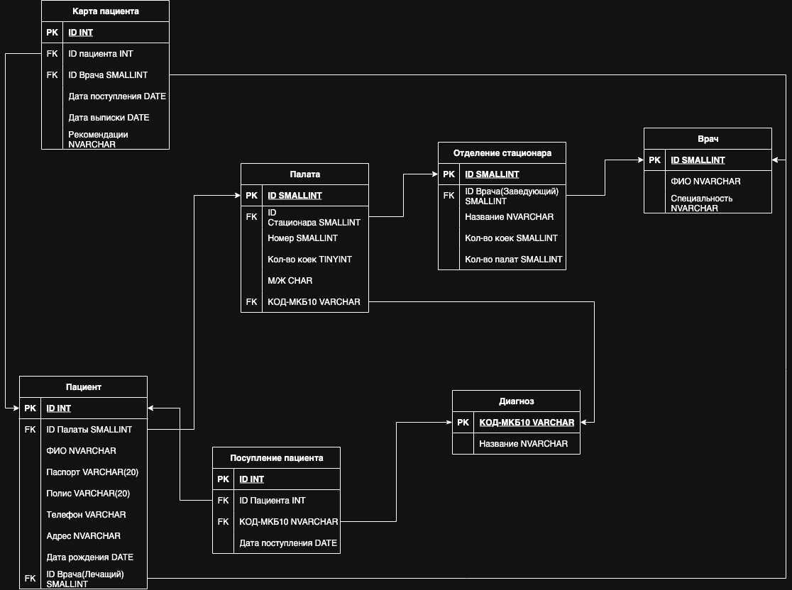

## Лабораторная работа №2
Реализация физической модели в СУБД Microsoft SQL Server на основе реляционной модели(построенной в 1-ой лабораторной работе)
### Диаграмма построенная на основе кода mssql(в СУБД dbeaver)

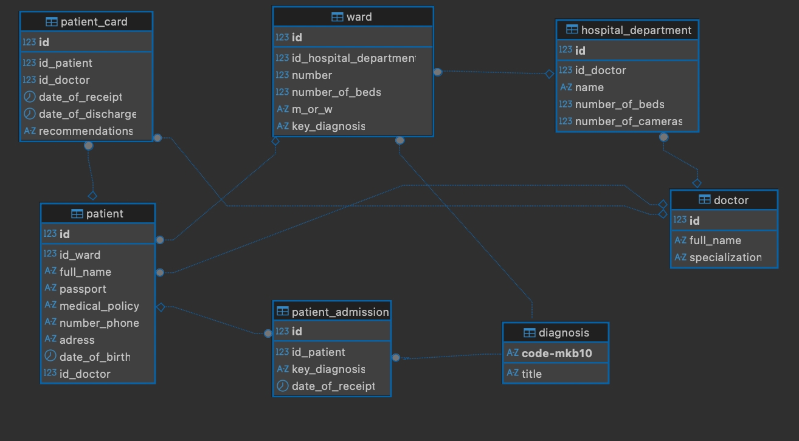

### Пример создания таблицы
```sql
CREATE TABLE ward(
    id SMALLINT IDENTITY(1,1) PRIMARY KEY,
    id_hospital_department SMALLINT FOREIGN KEY REFERENCES hospital_department(id),
    number SMALLINT,
    number_of_beds SMALLINT,
    m_or_w CHAR(1) CHECK (m_or_w IN ('M', 'W')),
    key_diagnosis VARCHAR(6) NOT NULL FOREIGN KEY REFERENCES diagnosis([code-mkb10])
);
```
### Пример заполнения таблицы

```sql
INSERT INTO doctor (full_name, specialization) VALUES
('Иванов Александр Сергеевич', 'Кардиолог'),
('Петрова Елена Владимировна', 'Эндокринолог'),
('Сидоров Михаил Петрович', 'Пульмонолог'),
('Кузнецова Ольга Ивановна', 'Гастроэнтеролог'),
('Николаев Дмитрий Алексеевич', 'Невролог'),
('Волкова Анна Сергеевна', 'Терапевт'),
('Семенов Игорь Николаевич', 'Хирург'),
('Федорова Марина Дмитриевна', 'Уролог'),
('Павлов Алексей Викторович', 'Офтальмолог'),
('Соколова Татьяна Михайловна', 'Отоларинголог');
```

[Полный код](https://github.com/TPYBO4UST/Labs_BD_PMI32/blob/main/Lab_2/Lab2.sql)


## Лабораторная работа №3
### Освоение продвинутых возможностей SQL на примере базы данных больницы. Включает построение запросов различной сложности для анализа медицинских данных.

### 📁 Разграничение по файлам:

- **Часть 1 пункт 1** - файл [Part_I_1.sql](https://github.com/TPYBO4UST/Labs_BD_PMI32/blob/main/Lab_3/Part_I_1.sql)
- **Часть 1 пункт 2** - файл [Part_I_2.sql](https://github.com/TPYBO4UST/Labs_BD_PMI32/blob/main/Lab_3/Part_I_2.sql)
- **Часть 1 пункты 3-6** - файл [Part_I_3456.sql](https://github.com/TPYBO4UST/Labs_BD_PMI32/blob/main/Lab_3/Part_I_3456.sql)
- **Часть 2** - файл [Part_II.sql](https://github.com/TPYBO4UST/Labs_BD_PMI32/blob/main/Lab_3/Part_II.sql)

### 📄 Полная документация:
[📥 Скачать отчет](https://github.com/TPYBO4UST/Labs_BD_PMI32/raw/main/Lab_3/Отчет.docx) - код sql + консоль вывода


## Лабораторная работа №4
### Создание Хранимых процедур, пользовательских функций и триггеров на mssql.

### 1. [Хранимый процедуры](Lab_4/procedure.sql)
### Вывод консоли:
#### Задание А
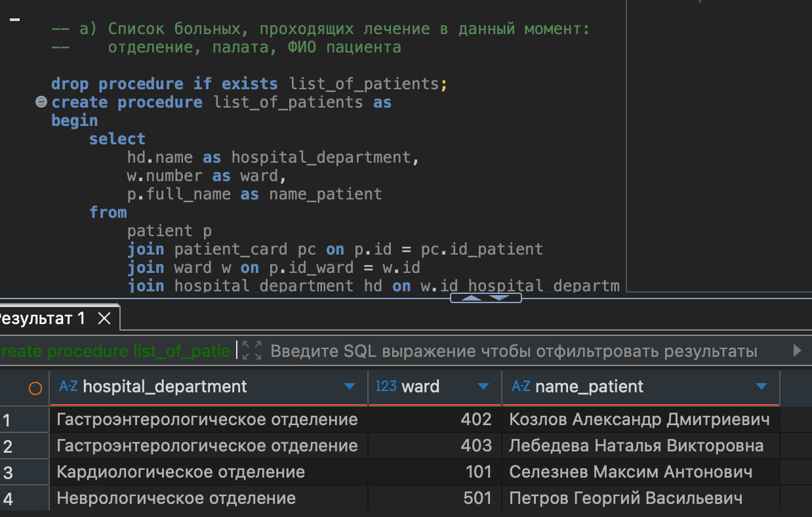

#### Задание B
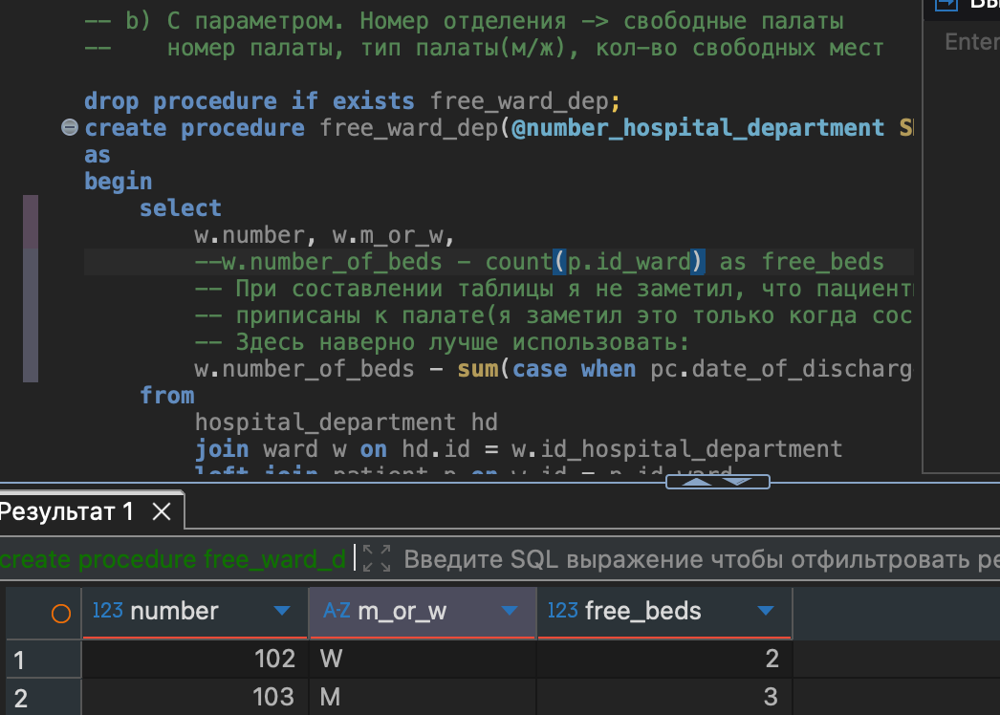

#### Задание C
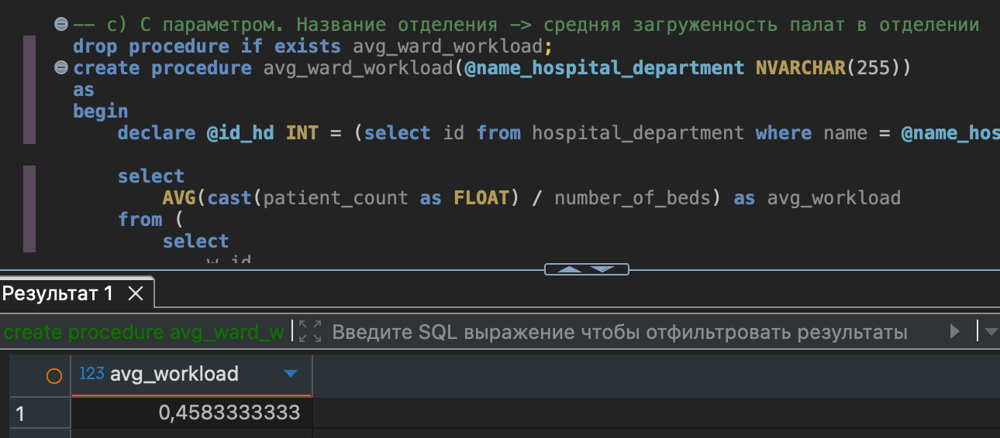

#### Задание D
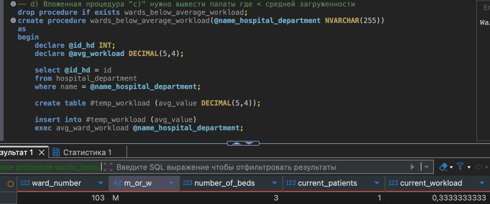

### 2. [Пользовательские функции](Lab_4/function.sql)
#### Задание А
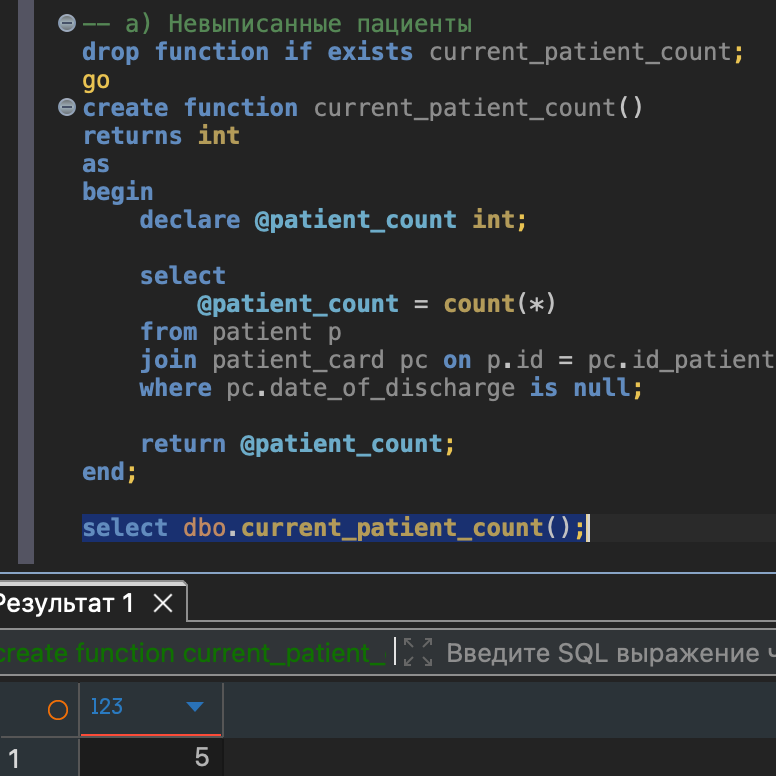

#### Задание B
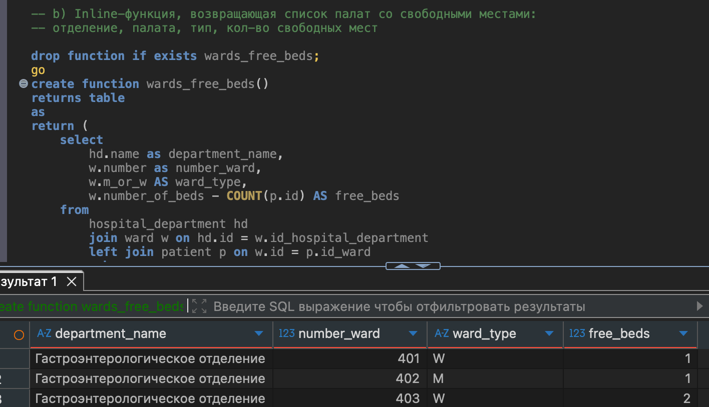

#### Задание C
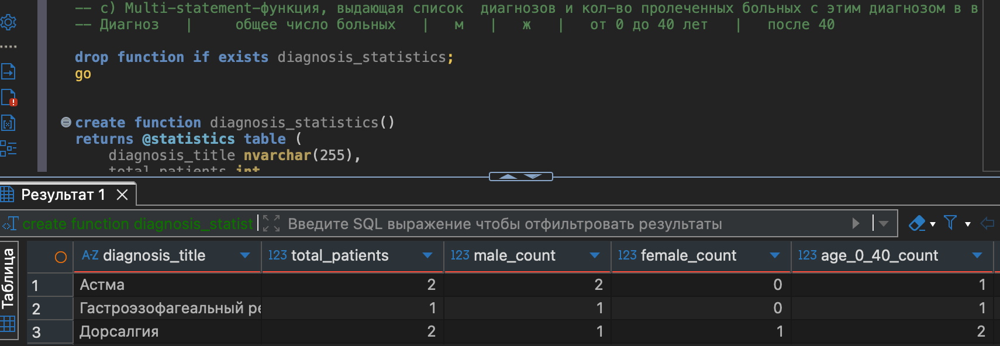

### 3. [Триггеры](Lab_4/triggers.sql)
#### Задание А
#### Смотрим на загруженные палаты:
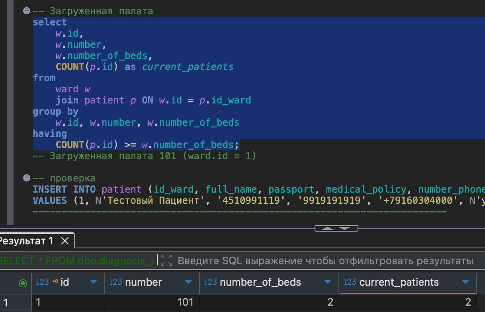
#### Работа триггера 
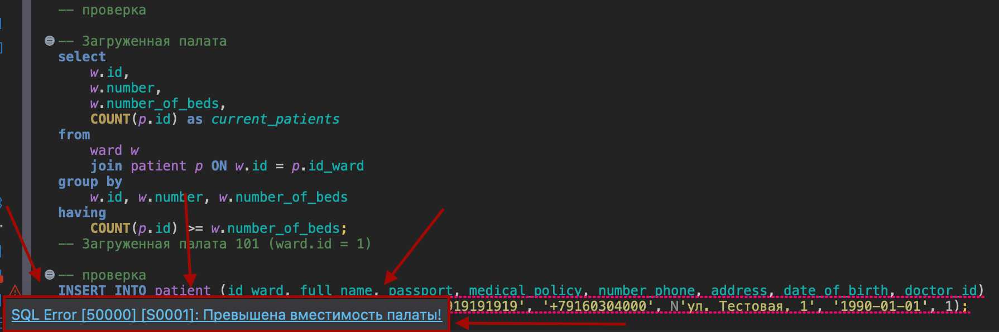

#### Задание B
#### Выводим людей, которых хотим выписать

#### Работа триггера(в правом углу видем принт, в таблице палата 402 стала свободна):
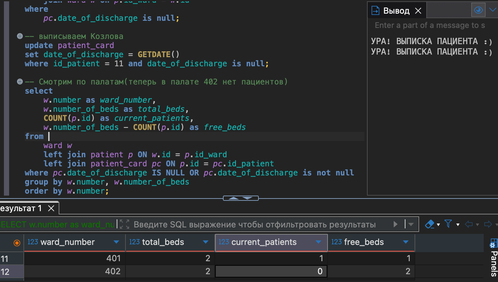

#### Задание С
#### Работа триггера(удаление палат без пациентов)


## Лабораторная работа №5.
### Данная лаборторная работа направлена на изучение изучение механизмов управления доступом в СУБД MS SQL Server через создание ролей, назначение прав и применение динамического маскирования данных.
#### [Файл](Lab_5/lab_5_role.sql)
#### P.S. Сдается очно.
