# Оглавление:
1. [Лабораторная работа №1](#лабораторная-работа-1)
2. [Лабораторная работа №2](#лабораторная-работа-2)
3. [Лабораторная работа №3](#лабораторная-работа-3)
4. [Лабораторная работа №4](#лабораторная-работа-4)
5. [Лабораторная работа №5](#лабораторная-работа-5)
6. [Лабораторная работа №6](#лабораторная-работа-6)
7. [Лабораторная работа №7](#лабораторная-работа-7)
8. [Лабораторная работа №8](#лабораторная-работа-8)

# 🏥 Автоматизация работы стационара в больнице

[Вариант 26](https://docs.google.com/document/d/1P1bwsIgZWwOLAHFtYpFxWD9C4rTAEKkA/edit?tab=t.0)

## 📋 О проекте

Проект представляет собой систему автоматизации работы стационара медицинского учреждения. Реализована реляционная база данных для управления пациентами, врачами, отделениями и медицинскими записями.

### Описание Предметной области

<li>Информация об отделениях стационара: название, кол-во коек, кол-во палат, заведующий</li>
<li>Пациенты: ФИО, паспорт, полис, телефон, адрес, дата рождения, лечащий врач</li>
<li>Врачи: ФИО, специальность</li>
<li>Палаты: кол-во коек, м/ж</li>
P.S. Решили что лечащего врача лучше прикреплять к пациенту.

## Лабораторная работа №1
### 1. Модель "Сущность-Связь"


### 2. Реляционная модель


## Лабораторная работа №2
Реализация физической модели в СУБД Microsoft SQL Server на основе реляционной модели(построенной в 1-ой лабораторной работе)
### Диаграмма построенная на основе кода mssql(в СУБД dbeaver)


### Пример создания таблицы
```sql
CREATE TABLE ward(
    id SMALLINT IDENTITY(1,1) PRIMARY KEY,
    id_hospital_department SMALLINT FOREIGN KEY REFERENCES hospital_department(id),
    number SMALLINT,
    number_of_beds SMALLINT,
    m_or_w CHAR(1) CHECK (m_or_w IN ('M', 'W')),
    key_diagnosis VARCHAR(6) NOT NULL FOREIGN KEY REFERENCES diagnosis([code-mkb10])
);
```
### Пример заполнения таблицы

```sql
INSERT INTO doctor (full_name, specialization) VALUES
('Иванов Александр Сергеевич', 'Кардиолог'),
('Петрова Елена Владимировна', 'Эндокринолог'),
('Сидоров Михаил Петрович', 'Пульмонолог'),
('Кузнецова Ольга Ивановна', 'Гастроэнтеролог'),
('Николаев Дмитрий Алексеевич', 'Невролог'),
('Волкова Анна Сергеевна', 'Терапевт'),
('Семенов Игорь Николаевич', 'Хирург'),
('Федорова Марина Дмитриевна', 'Уролог'),
('Павлов Алексей Викторович', 'Офтальмолог'),
('Соколова Татьяна Михайловна', 'Отоларинголог');
```

[Полный код](https://github.com/TPYBO4UST/Labs_BD_PMI32/blob/main/Lab_2/Lab2.sql)


## Лабораторная работа №3
### Освоение продвинутых возможностей SQL на примере базы данных больницы. Включает построение запросов различной сложности для анализа медицинских данных.

### 📁 Разграничение по файлам:

- **Часть 1 пункт 1** - файл [Part_I_1.sql](https://github.com/TPYBO4UST/Labs_BD_PMI32/blob/main/Lab_3/Part_I_1.sql)
- **Часть 1 пункт 2** - файл [Part_I_2.sql](https://github.com/TPYBO4UST/Labs_BD_PMI32/blob/main/Lab_3/Part_I_2.sql)
- **Часть 1 пункты 3-6** - файл [Part_I_3456.sql](https://github.com/TPYBO4UST/Labs_BD_PMI32/blob/main/Lab_3/Part_I_3456.sql)
- **Часть 2** - файл [Part_II.sql](https://github.com/TPYBO4UST/Labs_BD_PMI32/blob/main/Lab_3/Part_II.sql)

### 📄 Полная документация:
[📥 Скачать отчет](https://github.com/TPYBO4UST/Labs_BD_PMI32/raw/main/Lab_3/Отчет.docx) - код sql + консоль вывода


## Лабораторная работа №4
### Создание Хранимых процедур, пользовательских функций и триггеров на mssql.

### 1. [Хранимый процедуры](Lab_4/procedure.sql)
### Вывод консоли:
#### Задание А


#### Задание B


#### Задание C


#### Задание D


### 2. [Пользовательские функции](Lab_4/function.sql)
#### Задание А


#### Задание B


#### Задание C


### 3. [Триггеры](Lab_4/triggers.sql)
#### Задание А
#### Смотрим на загруженные палаты:

#### Работа триггера 


#### Задание B
#### Выводим людей, которых хотим выписать

#### Работа триггера(в правом углу видем принт, в таблице палата 402 стала свободна):


#### Задание С
#### Работа триггера(удаление палат без пациентов)


## Лабораторная работа №5.
### Данная лаборторная работа направлена на изучение изучение механизмов управления доступом в СУБД MS SQL Server через создание ролей, назначение прав и применение динамического маскирования данных.
#### [Файл](Lab_5/lab_5_role.sql)
#### P.S. Сдается очно.

## Лабораторная работа №6.
### Преобразование реляционной модели базы данных больницы в графовую с использованием узлов и ребер.

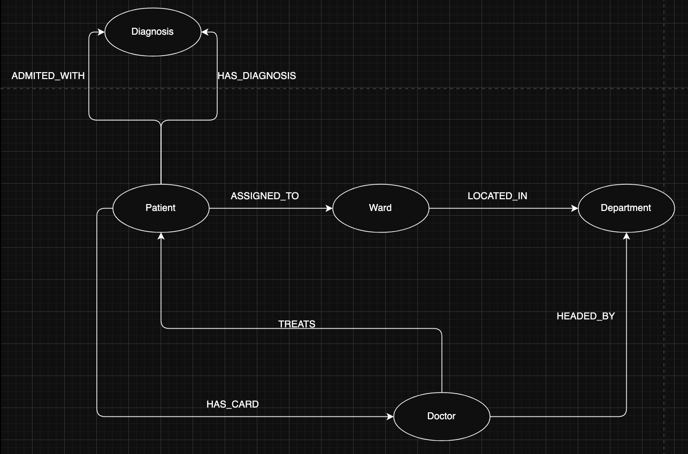

- **Создание узлов и ребер** - [Create file](Lab_6/Lab_6_create.sql)
- **Заполнение из 2 Лабы** - [Insert file](Lab_6/Lab_6_insert.sql)
- **Реализация запросов из 3 лабы** -  

### Выводы запросов 3.2
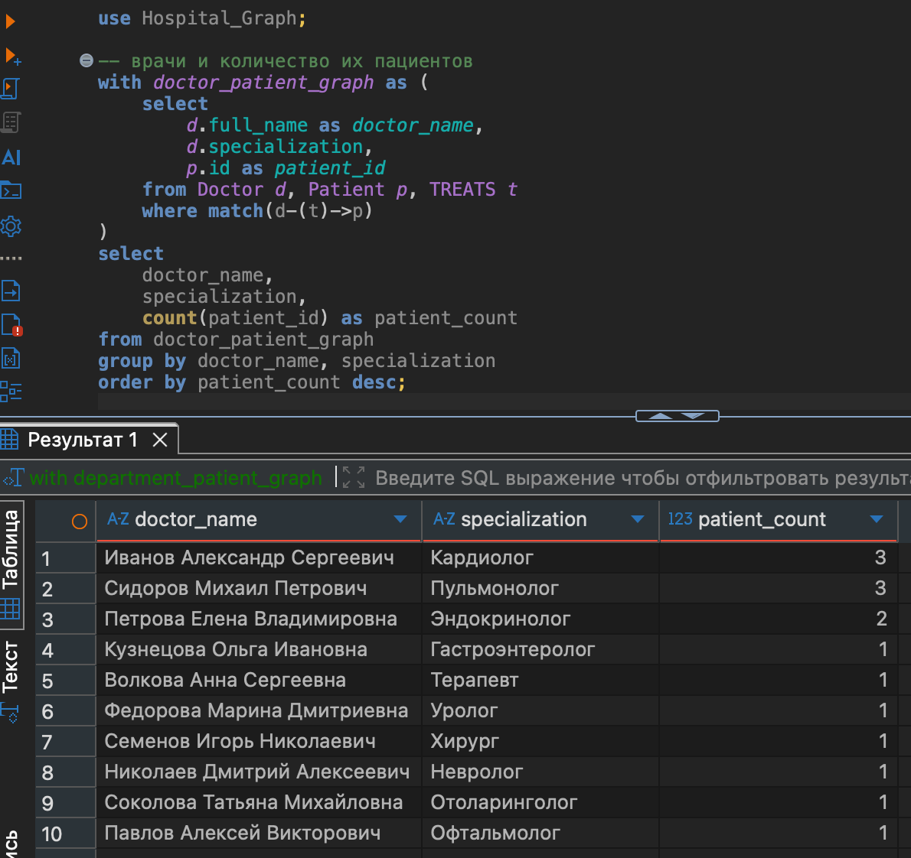

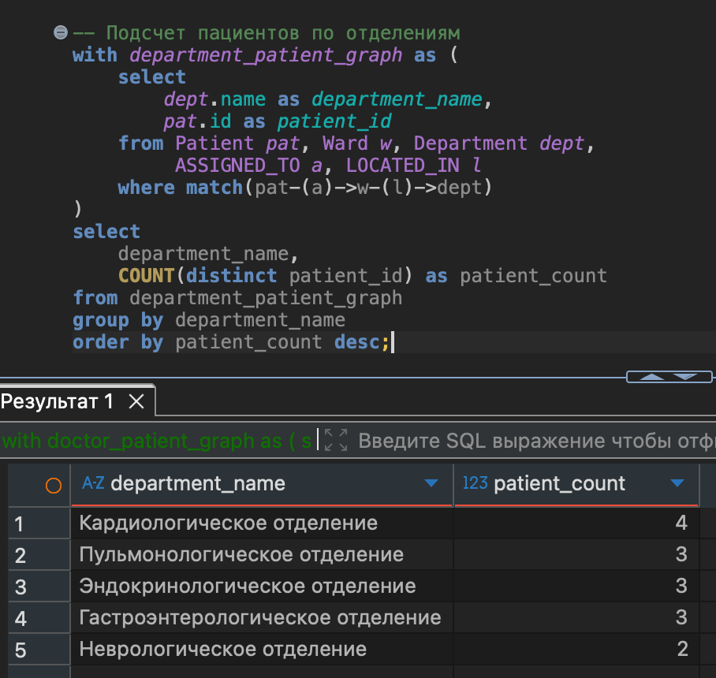


## Лабораторная работа №7.
### Изучение транзакций в mssql

### Задание 1. Транзакции с откатом и фиксацией
- **Код задания 1**- 
#### Транзакция с откатом
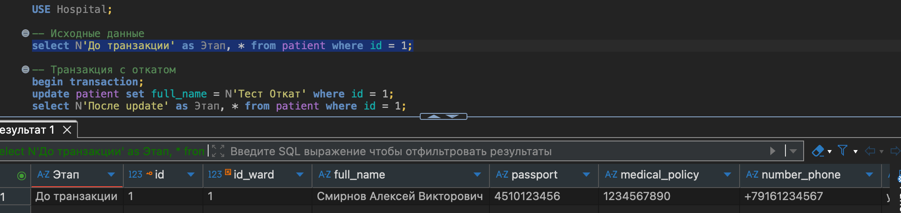
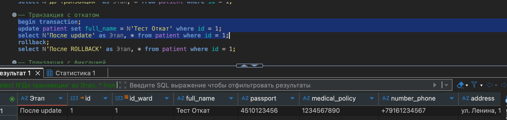
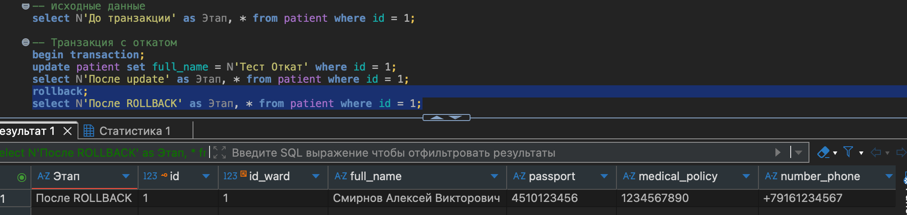
#### Транзакция с фиксацией
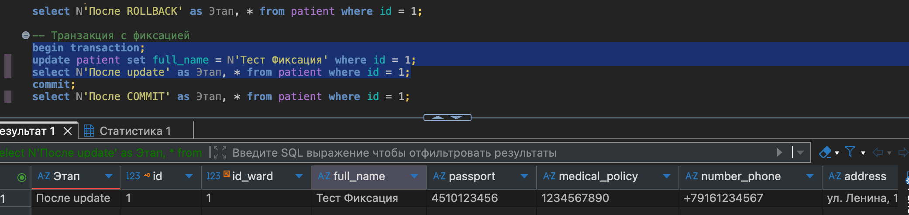
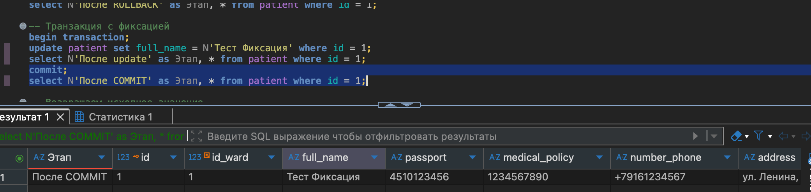

### Задание 2. Проверка уровней изоляции транзакций
#### 1. Уровень изоляции READ UNCOMMITTED
- **Код сессии 1**- 
- **Код сессии 2**- 


- **Сеанс 1: Начинает транзакцию и изменяет адрес пациента с id=1**
- **Сеанс 2: Видит измененный адрес "Новый адрес (грязное чтение)" даже до коммита**
- **Сеанс 1: Откатывает транзакцию**
- **Результат: Сеанс 2 прочитал "грязные" данные, которые не были зафиксированы**

#### 2. Уровень изоляции READ COMMITTED
- **Код сессии 1**- 
- **Код сессии 2**- 


- **Сеанс 1: Первое чтение возвращает старый адрес**
- **Сеанс 2: Изменяет адрес и фиксирует изменения**
- **Сеанс 1: Второе чтение возвращает уже измененный адрес**
- **Результат: Неповторяющееся чтение - два чтения в одной транзакции вернули разные данные**

#### 3. Уровень изоляции REPEATABLE READ
- **Код сессии 1**- 
- **Код сессии 2**- 


- **Сеанс 1: Первое чтение возвращает, например, 2 пациента в палате 1**
- **Сеанс 2: Добавляет нового пациента в палату 1**
- **Сеанс 1: Второе чтение возвращает 3 пациента**
- **Результат: Фантомное чтение - появилась новая запись, удовлетворяющая условию запроса**

#### 4. Уровень изоляции SERIALIZABLE
- **Код сессии 1**- 
- **Код сессии 2**- 

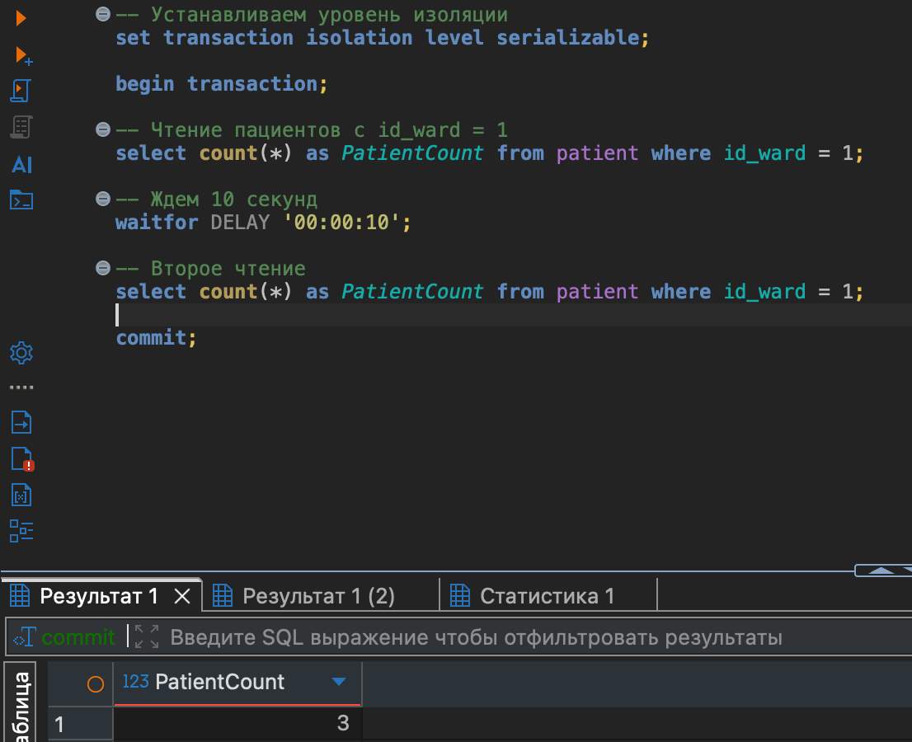
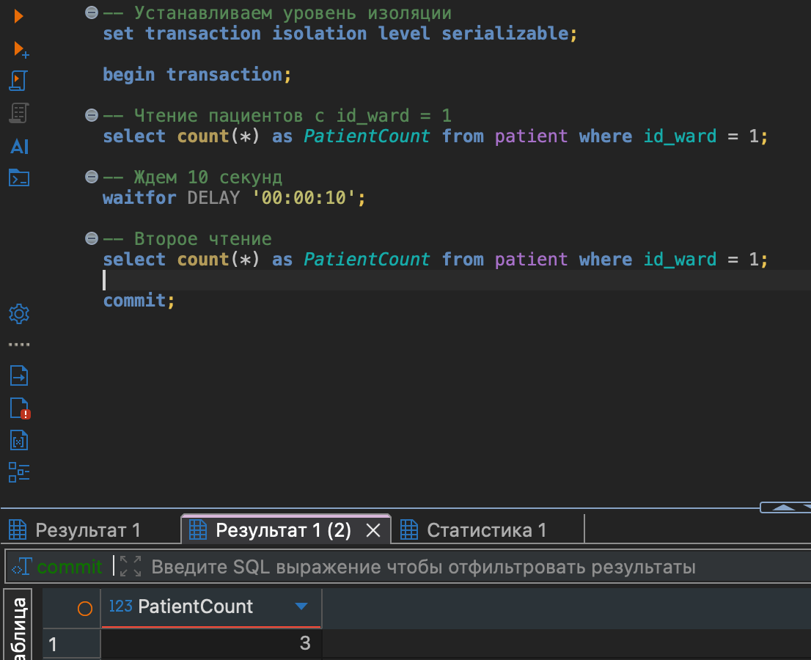
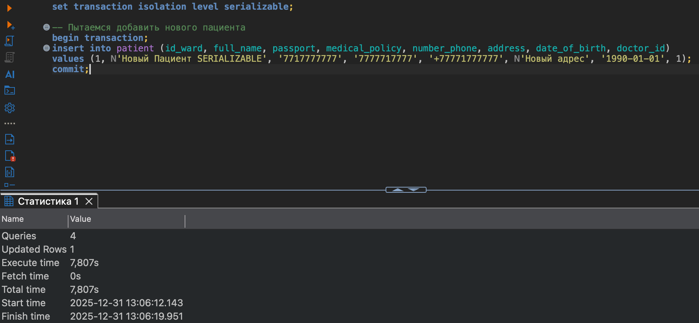

- **Сеанс 1: Начинает транзакцию и блокирует диапазон записей**
- **Сеанс 2: Пытается вставить новую запись, но операция блокируется до завершения транзакции в сеансе 1**
- **Сеанс 1: Завершает транзакцию**
- **Сеанс 2: Выполняет вставку**
- **Результат: Фантомное чтение предотвращено - оба чтения в сеансе 1 вернули одинаковое количество записей**

## Лабораторная работа №8.
### Изучеие mongodb

## Задание 1: Работа с коллекцией restaurants.json

### 1. Вывод всех документов без _id
```javascript
db.restaurants.find(
  {},
  { _id: 0, restaurant_id: 1, name: 1, borough: 1, cuisine: 1 }
).limit(5)
```
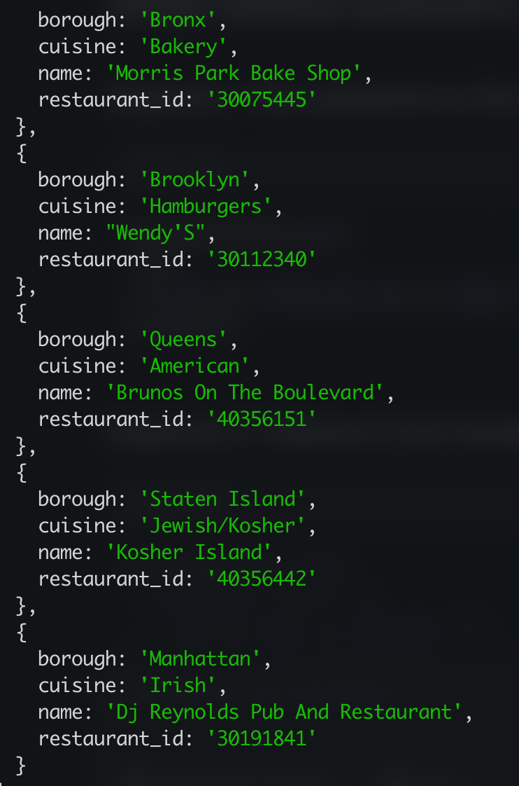

### 2. Первые 5 ресторанов из Bronx по алфавиту
```javascript
db.restaurants.find(
    { borough: "Bronx" },
    {
        _id: 0,
        restaurant_id: 1,
        name: 1,
        borough: 1,
        cuisine: 1
    }
)
.sort({ name: 1 })
.limit(5)
```
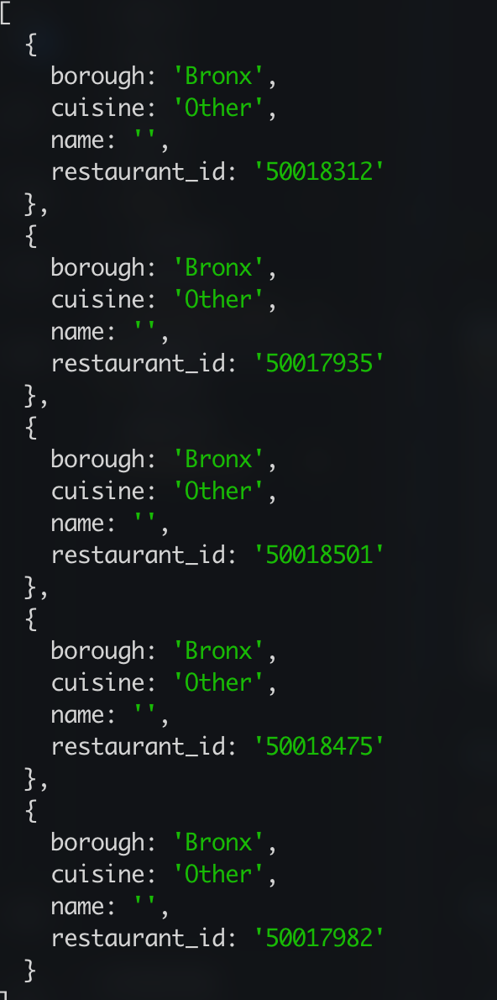

### 3. Рестораны с оценкой 80-100
```javascript
db.restaurants.find({
  "grades.score": { $gt: 80, $lt: 100 }
}).limit(5)
```
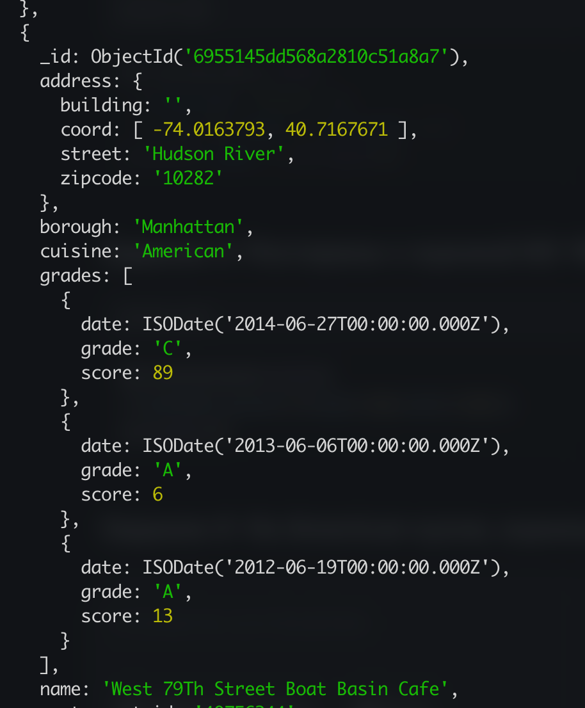

### 4. Не American кухня, оценка A, не Brooklyn
```javascript
db.restaurants.find({
  cuisine: { $ne: "American" },
  "grades.grade": "A",
  borough: { $ne: "Brooklyn" }
}).sort({ cuisine: -1 }).limit(5)
```
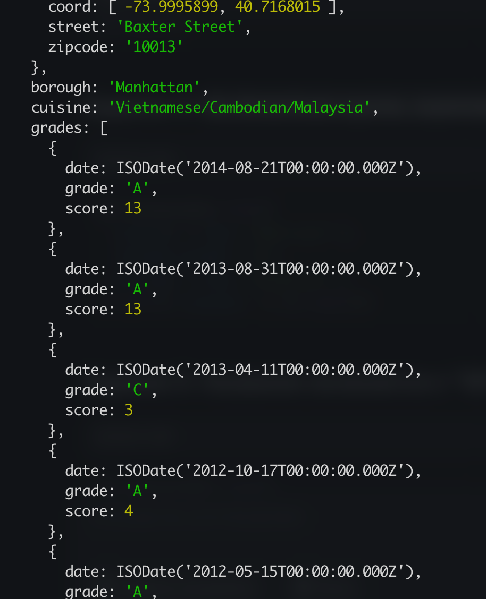

### 5. Название начинается с "Wil"
```javascript
db.restaurants.find({
  name: /^Wil/
}, {
  _id: 0,
  restaurant_id: 1,
  name: 1,
  borough: 1,
  cuisine: 1
})
```
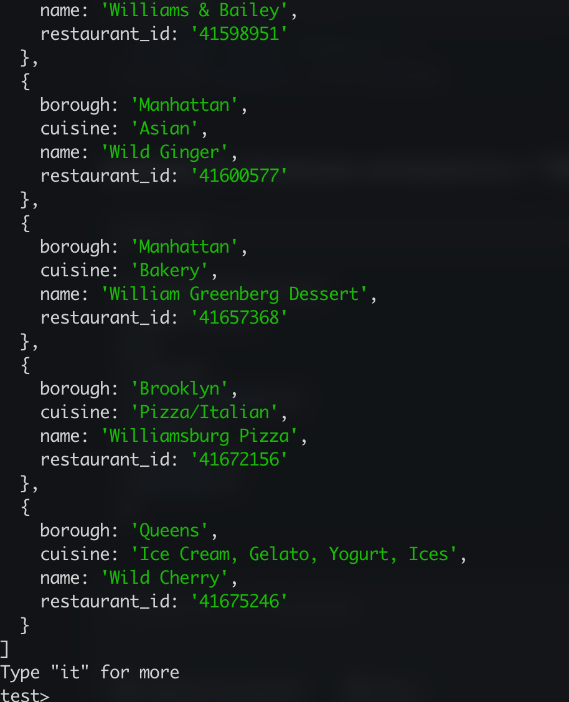

### 6. Bronx и (American или Chinese)
```javascript
db.restaurants.find({
  borough: "Bronx",
  cuisine: { $in: ["American", "Chinese"] }
}, {
  _id: 0,
  name: 1,
  cuisine: 1
}).limit(10)
```
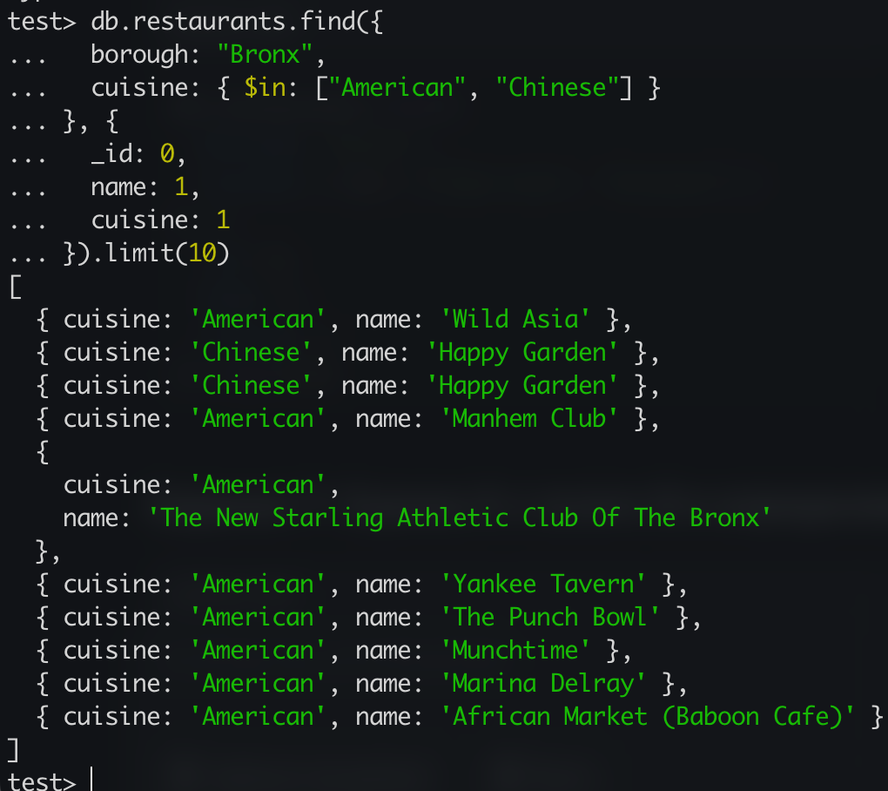

### 7. Оценка A с score=9 в определенную дату
```javascript
db.restaurants.find({
  "grades": {
    $elemMatch: {
      "grade": "A",
      "score": 9,
      "date": ISODate("2014-08-11T00:00:00Z")
    }
  }
}, {
  _id: 0,
  restaurant_id: 1,
  name: 1,
  grades: 1
})
```
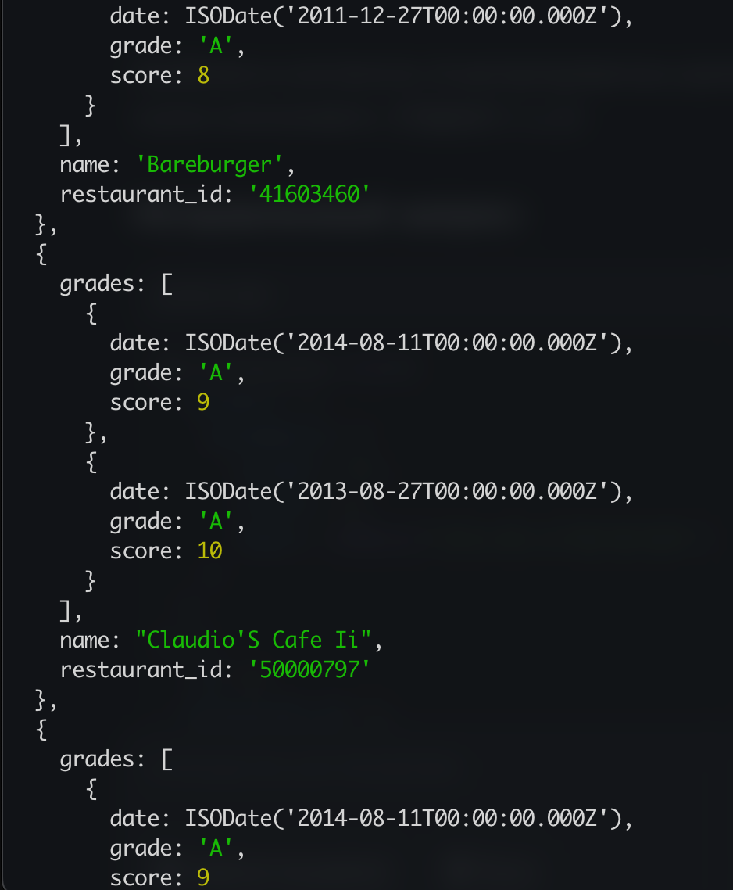

### 8. Количество ресторанов по районам и кухням
```javascript
db.restaurants.aggregate([
  {
    $group: {
      _id: {
        borough: "$borough",
        cuisine: "$cuisine"
      },
      count: { $sum: 1 }
    }
  },
  {
    $project: {
      _id: 0,
      borough: "$_id.borough",
      cuisine: "$_id.cuisine",
      count: 1
    }
  },
  { $sort: { borough: 1, cuisine: 1 } }
])
```
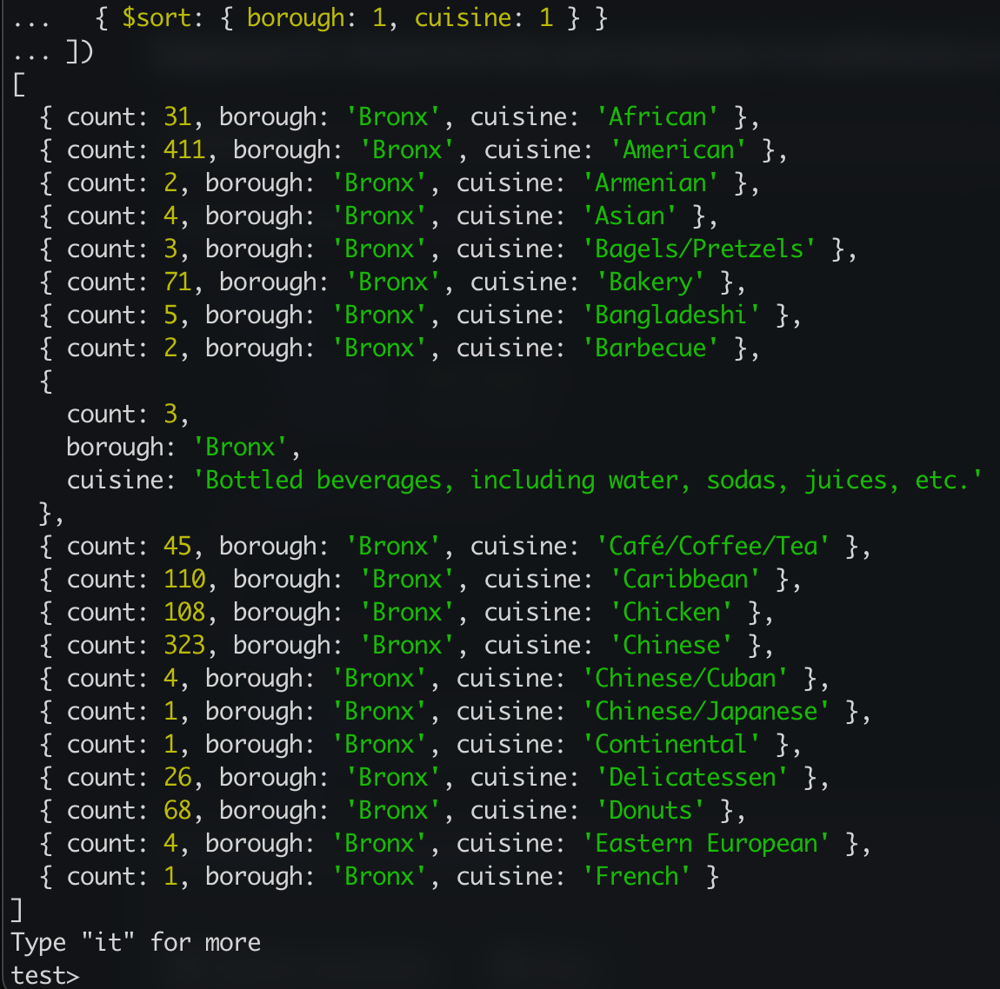

### 9. Ресторан с минимальной суммой баллов в Bronx
```javascript
db.restaurants.aggregate([
  { $match: { borough: "Bronx" } },
  {
    $addFields: {
      totalScore: {
        $sum: "$grades.score"
      }
    }
  },
  { $sort: { totalScore: 1 } },
  { $limit: 1 }
])
```
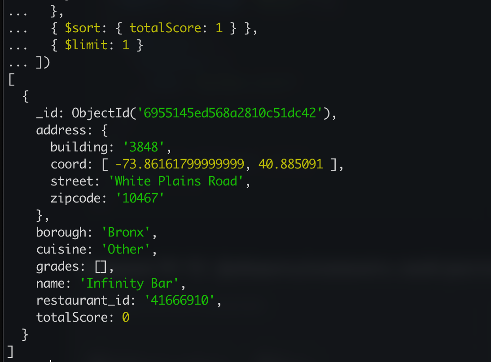

### 10. Добавить любимый ресторан:
```javascript
db.restaurants.insertOne({
  restaurant_id: "99999999",
  name: "Мой любимый ресторан",
  borough: "Manhattan",
  cuisine: "Russian",
  address: {
    building: "123",
    street: "Main Street",
    zipcode: "10001",
    coord: [-73.9857, 40.7484]
  },
  grades: [
    { date: new Date(), grade: "A", score: 10 }
  ]
})
```
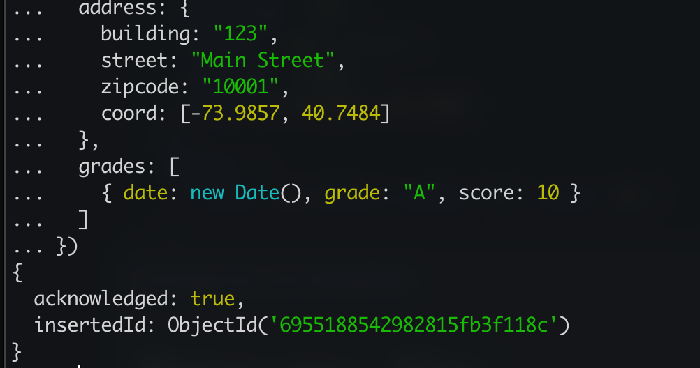

### 11. Добавить время работы:
```javascript
db.restaurants.updateOne(
  { restaurant_id: "99999999" },
  {
    $set: {
      working_hours: {
        monday: "09:00-22:00",
        tuesday: "09:00-22:00",
        wednesday: "09:00-22:00",
        thursday: "09:00-22:00",
        friday: "09:00-23:00",
        saturday: "10:00-23:00",
        sunday: "10:00-21:00"
      }
    }
  }
)
```
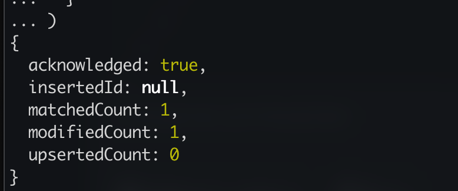

### 12. Изменить время работы:
```javascript
db.restaurants.updateOne(
  { restaurant_id: "99999999" },
  {
    $set: {
      "working_hours.sunday": "11:00-20:00",
      "working_hours.friday": "09:00-24:00"
    }
  }
)
```

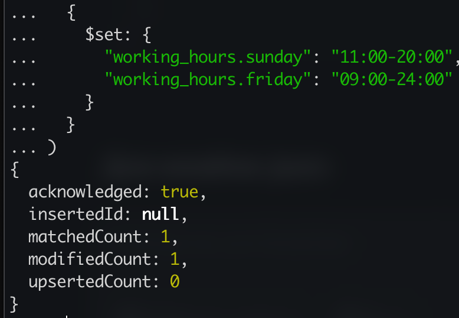


## Задание 1: Работа с коллекцией weather.json

### 1. Разница между максимальной и минимальной температурой
```javascript
db.weather.aggregate([
  {
    $group: {
      _id: null,
      maxTemp: { $max: "$temperature" },
      minTemp: { $min: "$temperature" }
    }
  },
  {
    $project: {
      _id: 0,
      difference: { $subtract: ["$maxTemp", "$minTemp"] }
    }
  }
])
```
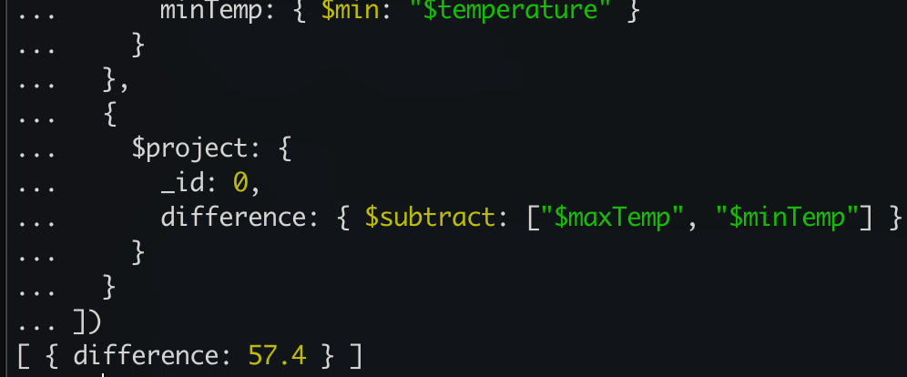

### 2. Средняя температура без 10 самых низких и высоких:
```javascript
db.weather.aggregate([
  { $sort: { temperature: 1 } },
  {
    $group: {
      _id: null,
      temps: { $push: "$temperature" }
    }
  },
  {
    $project: {
      _id: 0,
      avgTemp: {
        $avg: {
          $slice: [
            "$temps",
            10,
            { $subtract: [{ $size: "$temps" }, 20] }
          ]
        }
      }
    }
  }
])
```
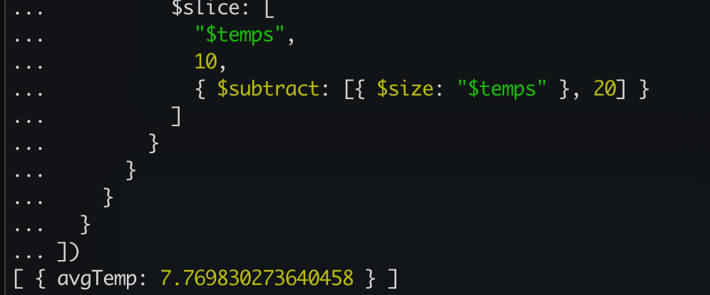

### 3. 10 самых холодных дней с южным ветром:
```javascript
db.weather.aggregate([
  { $match: { wind_direction: "Южный" } },
  { $sort: { temperature: 1 } },
  { $limit: 10 },
  {
    $group: {
      _id: null,
      avgTemp: { $avg: "$temperature" },
      records: { $push: "$$ROOT" }
    }
  }
])
```
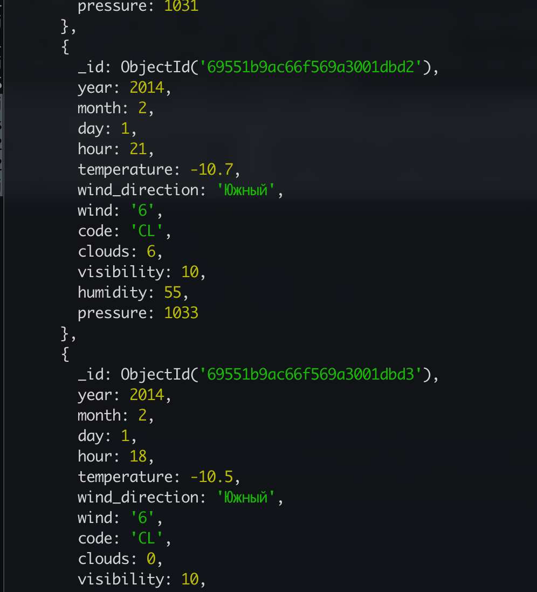

### 4. Дни со снегом (температура < 0 и code = "SN"):
```javascript
db.weather.aggregate([
  { 
    $match: { 
      temperature: { $lt: 0 },
      code: "SN"
    } 
  },
  {
    $group: {
      _id: {
        year: "$year",
        month: "$month",
        day: "$day"
      }
    }
  },
  { $count: "snow_days" }
])
```
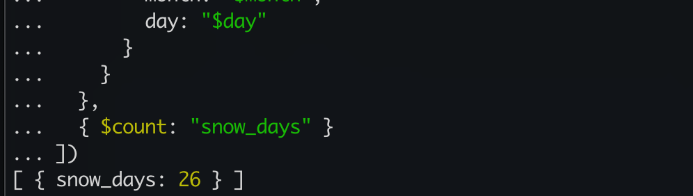

### 5. Разница между снегом и дождем зимой:
```javascript
db.weather.aggregate([
  { $match: { month: { $in: [12, 1, 2] } } },
  {
    $group: {
      _id: "$code",
      count: { $sum: 1 }
    }
  },
  { $sort: { _id: 1 } }
])
```
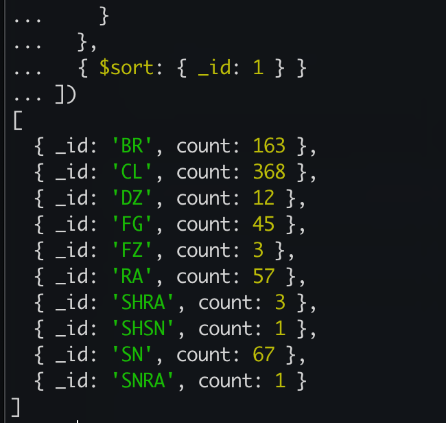

### 6. Вероятность осадков в ясный день:
```javascript
db.weather.aggregate([
  {
    $group: {
      _id: {
        year: "$year",
        month: "$month",
        day: "$day"
      },
      clear_count: {
        $sum: { $cond: [{ $eq: ["$code", "CL"] }, 1, 0] }
      },
      total_measurements: { $sum: 1 },
      has_precipitation: {
        $max: { $cond: [{ $ne: ["$code", "CL"] }, 1, 0] }
      }
    }
  },
  {
    $match: {
      $expr: {
        $gt: [
          { $divide: ["$clear_count", "$total_measurements"] },
          0.75
        ]
      }
    }
  },
  {
    $group: {
      _id: null,
      total_clear_days: { $sum: 1 },
      precipitation_days: { $sum: "$has_precipitation" }
    }
  },
  {
    $project: {
      _id: 0,
      probability: {
        $multiply: [
          { $divide: ["$precipitation_days", "$total_clear_days"] },
          100
        ]
      }
    }
  }
])
```
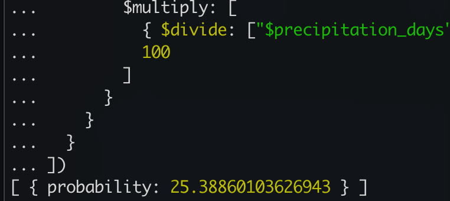

## 7. Изменение температуры в нечетные дни зимы:
```javascript
db.weather.aggregate([
  { 
    $match: { 
      month: { $in: [12, 1, 2] },
      day: { $mod: [2, 1] } // нечетные дни
    }
  },
  {
    $group: {
      _id: null,
      avgTempOriginal: { $avg: "$temperature" },
      count: { $sum: 1 }
    }
  },
  {
    $project: {
      _id: 0,
      avgTempOriginal: 1,
      avgTempIncreased: { $add: ["$avgTempOriginal", 1] },
      change: 1
    }
  }
])
```
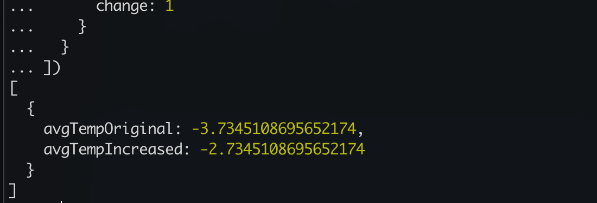